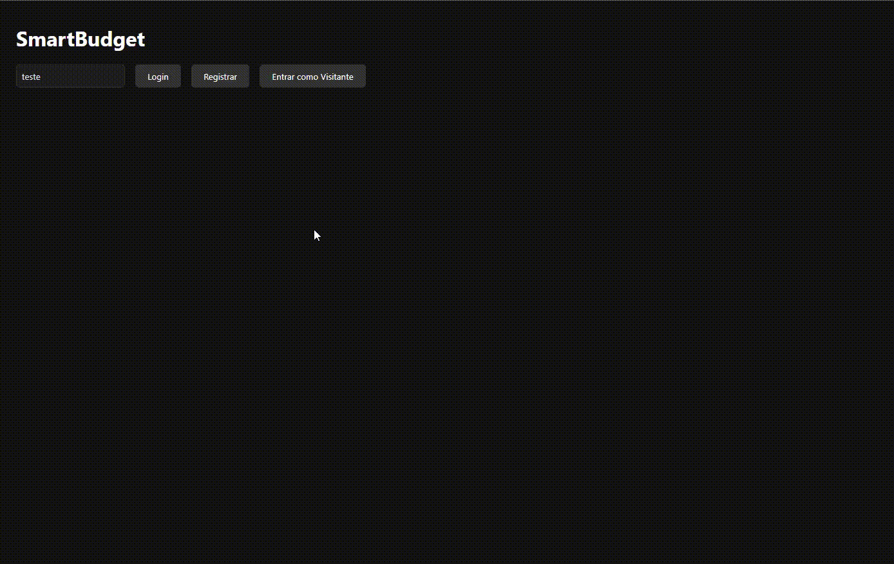

# SmartBudget Frontend

Frontend em **HTML, CSS e JavaScript** para o projeto SmartBudget, integrado ao backend em FastAPI.  
O objetivo é oferecer uma interface simples e responsiva para controle de transações financeiras e análise de dados.

## 🚀 Funcionalidades
- Login, registro e modo visitante.
- CRUD de transações (adicionar, listar, editar, excluir).
- Dashboard analítico:
  - Resumo geral (receitas, despesas, saldo).
  - Gráfico de pizza (gastos por categoria).
  - Gráfico de linha (evolução mensal).
- Tema escuro para maior conforto visual.

## 🛠️ Tecnologias
- HTML5
- CSS3 (tema escuro)
- JavaScript (ES6+)
- Chart.js (gráficos)
- Integração com backend FastAPI hospedado no Render

## 🎥 Demonstração

## 🌐 Demo Online
https://wilcleyber.github.io/smartbudget-frontend/

